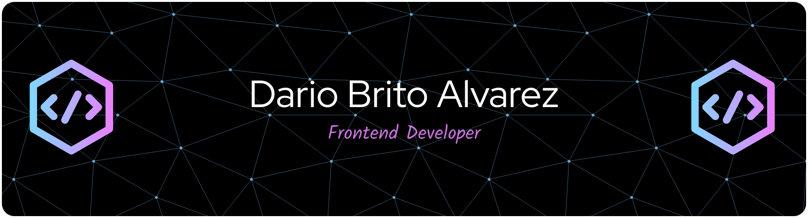

# [Dario Brito Alvarez](https://dbawebtech.eu) - Webentwickler & Webdesigner.

[.svg)](linkedin.com/in/dario-brito-alvarez-a869b12b0)

## Hi, ich bin Dario👋

  

  Ich arbeite mit Agenturen und Unternehmen zusammen, um performante, skalierbare und benutzerfreundliche Lösungen zu entwickeln.  
  Mein Ansatz: <strong>Design trifft Performance</strong> – klare Struktur, hohe Ladegeschwindigkeit und saubere Codebasis.  
  Ich bin ein <em>leidenschaftlicher Full-Stack-Entwickler</em> mit Fokus auf Webdesign, SEO und moderne Web-Apps.

> 💡 „Ich baue nicht nur Software – ich baue Lösungen, die Ideen voranbringen.“

## 🧰 Stacks

**Lenguajes:**  
Javascrtip , PHP , CSS, Markdown

**Frameworks & Librerías:**  
Angular • Astro • React

**CMS / Headless CMS:**  
WordPress • Directus • Strapi • Payload

**Infraestructura & DevOps:**  
Github • Docker

## 🌐 Conecta conmigo

- 🌍 [dbawebtech.eu](https://dbawebtech.eu)
- 💼 [LinkedIn](linkedin.com/in/dario-brito-alvarez-a869b12b0)
- ✉️ [Mail](mailto:brito@dbawebtech.eu)

